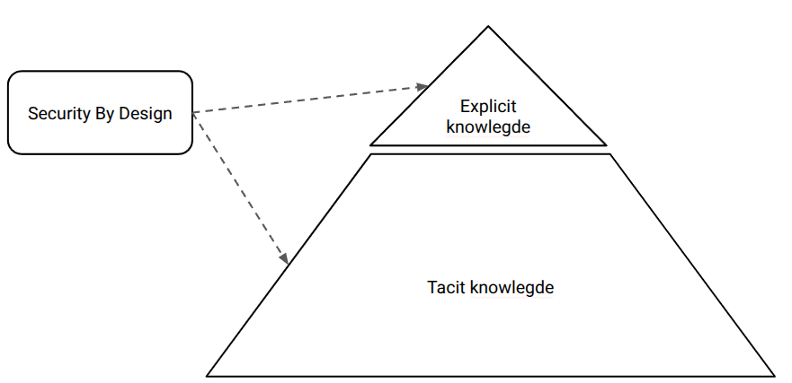

## The Importance of Tacit Knowledge in Security by Design

In Security by Design, the most effective security outcomes arise from the skilful interplay between **explicit knowledge** and **tacit knowledge**.

:::{tip} Explicit knowledge
**Explicit knowledge** is formal, codified, and easily shared. It includes security policies, architectural diagrams, threat models, compliance standards, coding guidelines, and documented best practices. 

This type of knowledge is essential for creating consistency, establishing baselines, onboarding new team members, and scaling secure development practices across an organisation.
:::

However, explicit knowledge alone is rarely enough to build truly resilient systems.

:::{tip} Tacit knowledge
**Tacit knowledge** represents the deeper, often unspoken layer of expertise that experienced practitioners develop over time. It encompasses intuition, practical judgement, pattern recognition, and the subtle "feel" for security that cannot be fully captured in documents or checklists. 

An experienced security architect might instinctively spot a dangerous design assumption, anticipate novel attack paths, or recognise when a "compliant" solution still feels wrong in context.
:::

While explicit knowledge tells you *what* to do, tacit knowledge guides you on *how* and *when* to apply it effectively — and, crucially, when to deviate from the rules.

Building simple, secure IT solutions relies heavily on **tacit** knowledge. This form of knowledge—gained through hands-on experience, contextual awareness, and professional judgement—enables practitioners to interpret requirements, anticipate risks, and make appropriate trade-offs in ways that cannot be fully captured in documentation.

Large Language Models (LLMs), such as ChatGPT, operate primarily on explicit knowledge derived from patterns in data. While they can provide useful general guidance, they lack direct awareness of your organisation’s specific systems, threat landscape, and operational context. As a result, their outputs should not be treated as authoritative or context-complete security advice.

AI tools can support learning and exploration, but they must be used with caution. Security decisions should always be validated by experienced professionals who possess the tacit knowledge necessary to assess real-world implications. Over-reliance on automated suggestions, without critical evaluation, risks introducing gaps that may not be immediately visible.

In practice, Security by Design means on combining the broad, accessible insights offered by tools with the deeper, experience-driven understanding held by practitioners.

## Why Tacit Knowledge Matters for Security by Design

Relying solely on explicit knowledge creates a dangerous illusion of security. Teams may tick every box on a checklist and meet every compliance requirement, yet still introduce critical vulnerabilities because they lack the contextual awareness and critical thinking that tacit knowledge provides.

Real-world security decisions frequently occur in ambiguous, complex situations where no documented rule perfectly fits. It is tacit knowledge that enables engineers and architects to:
- Recognise subtle design flaws that standard threat-modelling templates miss
- Anticipate how real users (or attackers) will actually interact with the system
- Make pragmatic risk decisions when perfect security conflicts with business needs
- Adapt established practices to new technologies and emerging threats

## Bridging the Gap: From Tacit to Explicit

The goal is not to eliminate tacit knowledge, but to nurture it and make as much of it as possible accessible to the wider team. Organisations that excel at Security by Design actively invest in converting valuable tacit knowledge into explicit forms, while simultaneously preserving and transmitting what remains inherently personal and experiential.

Effective approaches include:
- **Mentoring and shadowing** programmes
- **Pair design and collaborative threat modelling** sessions
- **Structured post-incident reviews** and "blameless" retrospectives
- **Communities of practice** and regular knowledge-sharing forums
- **Capturing design rationale** (not just the decision, but *why* it was made)

These practices help surface hidden insights and gradually turn individual expertise into organisational capability.

## The Optimal Balance

Robust Security by Design emerges from the synergy of both knowledge types:

- **Explicit knowledge** provides the essential structure, consistency, and scalability.
- **Tacit knowledge** supplies the depth, adaptability, judgement, and creative problem-solving required to deal with evolving and sophisticated threats.

Security leaders who understand this distinction move beyond simply mandating documentation and processes. They deliberately cultivate environments where experience is valued, reflection is encouraged, and knowledge flows naturally between individuals and teams.

:::{important} 
Great security is not just about what is written down — it is about what is **known, felt, and wisely applied** by the people designing, building, and maintaining your systems.
:::

:::{tip} 
Much tacit knowledge is embedded in **well-designed security tools**, often through secure defaults and automated safeguards.

However, do not trust built-in functionality blindly. Tools differ in quality and transparency, and hidden assumptions can introduce risks. Prefer open, well-documented solutions that you understand, and ensure they meet basic security standards—such as the [Python Security Applications Checklist](https://nocomplexity.com/documents/securityarchitecture/prevention/pythonsecurityapps.html#python-security-applications-checklist) for Python-based tools.
:::

