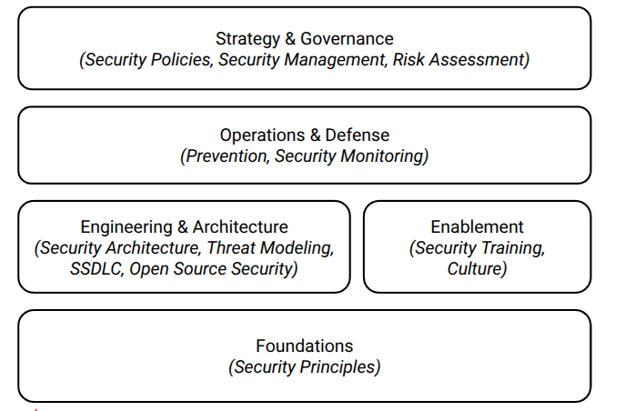

To truly master Security By Design, one must move beyond the reactive, bolt-on security measures of the past. Security By Design is not a single activity; it is a holistic mindset and a structured discipline that weaves security into the very fabric of a system, from the first whiteboard sketch to its eventual decommissioning. 

## Security By Design Framework

At first glance, "Security By Design" might sound like a single principle: simply build security in from the start. However, viewing it as one monolithic idea is misleading and, more importantly, impractical. In reality, Security By Design is best understood as a **framework** – a structured collection of interconnected topics that work together to achieve a secure outcome.

A framework provides a scaffold. It organises what would otherwise be a chaotic set of activities into a coherent, repeatable system. Just as a building framework requires separate but coordinated trades – foundations, structural engineering, electrical wiring, plumbing – so too does Security By Design require distinct but interdependent disciplines.

This framework view is essential:

1. Security Is Multi-Faceted:  A single topic, such as "threat modeling", cannot deliver security on its own. Without **security principles** to guide decisions, threat modeling lacks ethical and technical direction. Without **risk assessment**, it produces an unprioritised list of every possible attack, which is unactionable. Without **security policies**, there are no rules to enforce the mitigations it suggests. Each topic addresses a different facet of the problem: what to protect, how to protect it, who decides, and when to act.

+++

2. Topics Provide Specialised Focus:  No single person or process can master every aspect of security simultaneously. So breaking Security By Design into topics is needed. But mind: Each topic can be taught, measured, and improved independently, yet all are **useless in isolation.**

+++

3. The Framework Creates Dependencies and Feedback:  A true framework is not a checklist; it is a system of dependencies. 

+++ 

4. It Prevents the "Silver Bullet" Fallacy: Without a framework view, organisations often chase a single solution – "let's just do threat modeling" or "let's just buy a monitoring tool". These efforts fail because they address only one topic while ignoring the others. 

+++

5. The Framework Adapts to Context: Different organisations, systems, and risk profiles require different emphasis. A framework allows you to select and prioritise topics based on your specific environment. AI tools lack context. So you need to do the human hard work: Thinking!

:::{hint} A shift in thinking
**Mastering Security By Design requires a shift in thinking.**
:::

## Security By Design Topics

The topics is this course are the essential pillars of this proactive philosophy. Mastering each one is non-negotiable for building systems that are secure, resilient, and trustworthy by their very nature.

Below is an introduction to why each topic is critical to your journey on Mastering Security By Design.

- **[What is Security By Design](basics.md)**  
  Before you can practice it, you must define it. This topic establishes the core philosophy: shifting security left, embedding controls from the outset, and treating security as an enabler, not a blocker. Understanding the ‘what’ and ‘why’ sets the foundation for every decision that follows.

- **Prevention**  
  Prevention is the ultimate expression of proactive security. While detection and response are necessary safeties, relying on them is a sign of incomplete design. This topic teaches you how to architect systems that resist attacks by default—reducing the attack surface, enforcing least privilege, and eliminating entire classes of vulnerabilities before they can be exploited.

- **Threat Modeling**  
  You cannot defend against threats you have not imagined. Threat modeling provides the methodological rigour to identify, categorise, and prioritise potential adversaries and their attack paths—early in the design phase. Mastering this discipline turns security from guesswork into an engineering science.

- **Security Monitoring**  
  Even the best designs face novel attacks and insider threats. Monitoring is not about reacting after a breach; it is about designing observable systems that can signal distress in real time. This topic ensures you build for visibility, allowing you to detect anomalies, validate controls, and learn from near-misses continuously.

- **Security Policies**  
  Policy is the compass of secure design. Without clear, enforceable rules—on data classification, access control, encryption, and acceptable risk—engineers make inconsistent decisions. You will learn to craft policies that guide behaviour without stifling innovation, and more importantly, how to design systems that enforce policy technically.

- **Risk Assessment**  
  Perfect security is a myth. Risk assessment is the practical tool that tells you what to protect, to what degree, and at what cost. Mastering this topic enables you to make informed trade-offs, prioritise controls, and speak the language of business leaders—converting technical threats into business risks.

- **Security Management**  
  Design does not happen in a vacuum. Security management provides the governance, resource allocation, and oversight needed to embed security across teams and product lifecycles. You will learn how to run security as a management discipline—not a technical afterthought—ensuring accountability from the boardroom to the build server.

- **Security Principles**  
  Principles such as least privilege, defence in depth, fail secure, and economy of mechanism are the timeless laws of secure architecture. This topic grounds you in these enduring rules, giving you a mental checklist to evaluate any design decision. When complexity overwhelms, principles guide you back to safe ground.

- **Security Architecture**  
  Architecture is where principles meet practice. This topic equips you with patterns, reference models, and architectural reviews to design systems that are secure by composition—not by accident. You will learn to layer controls, isolate trust boundaries, and create designs that scale security as they scale functionality.

- **Secure Software Development Life Cycle (SSDLC)**  
  Security By Design must live in the developer’s daily workflow. The SSDLC integrates threat modeling, static analysis, secure coding standards, and security testing into every phase: requirements, design, development, testing, and deployment. Mastering this ensures security is not a gate but a continuous, automated partner in delivery.

- **Security Culture**  
  Processes and tools fail if the humans using them are not aligned. Culture is the soil in which security grows. This topic addresses the human factor: fostering psychological safety to report incidents, rewarding secure behaviour, and moving from blame to learning. Without culture, even the best design rots from within.

- **Open Source Security**  
  Modern systems are assembled, not built from scratch. Open source dependencies introduce hidden risks—from known vulnerabilities to supply chain attacks. Mastering this topic teaches you how to vet, monitor, and maintain open source components as rigorously as your own code, turning the ecosystem from a liability into an asset.

- **Security Training**  
  Finally, design is only as strong as the team that builds it. Security training ensures that every engineer, architect, and product owner possesses the baseline knowledge to make secure decisions. More importantly, advanced training creates internal champions who can guide others. This topic closes the loop from design to continuous human improvement.

In the following lessons, we will explore each of these topics in depth. Do not view them as isolated chapters; instead, see them as interlocking gears. When turned together, they drive the engine of true Security By Design.
