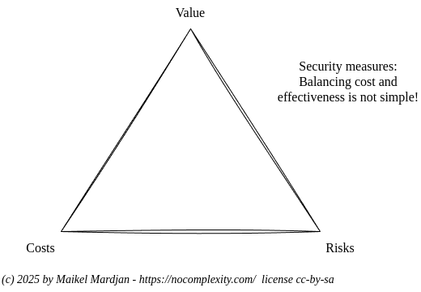
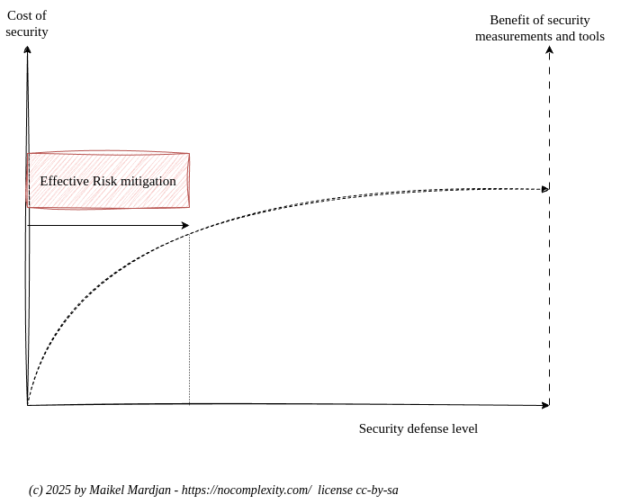
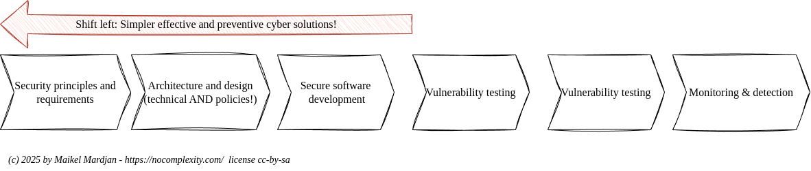
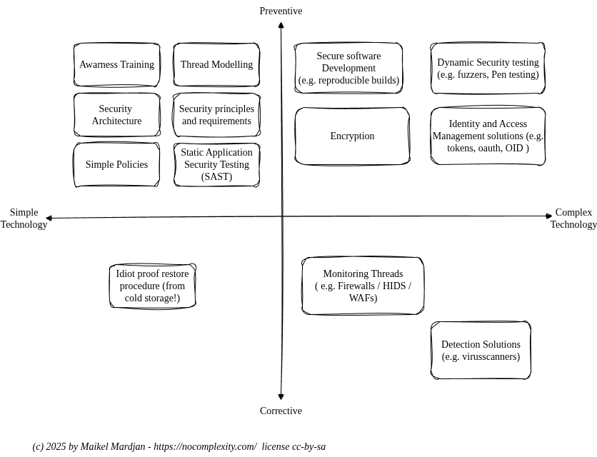

# Shift Left

Cyber security is inherently complex. However, effective security solutions do not need to be overly complicated or excessively expensive.

To avoid misunderstanding: simplifying your security landscape is not a simple task. It requires rethinking your strategy and reprioritising key objectives:

* Risks
* Costs
* Value

It is essential to recognise that risk can never be reduced to zero. A perfect, risk-free security solution does not exist. There will always be residual risks that cannot be fully mitigated—neither through technology nor through procedures. At the same time, budgets are finite. Security is not a visible feature, but a costly quality attribute that is often only noticed when it fails.

Increasing budgets or investing in more advanced cyber security technologies does not eliminate all risks. Instead, there is an optimal balance between cost and benefit.

What is required is a shift towards simpler, more effective thinking about cyber security controls.

This means placing greater emphasis on preventive measures—those that stop issues before they arise. Preventive controls are often less technical, and in many cases not technical at all. They typically focus on people, behaviour, trust, and clear procedures or policies that are easy to understand and follow without friction.

Effective and efficient security measures are frequently preventive in nature. They are often less costly to design, implement, and maintain, but may require changes in business processes or user behaviour. For example, instead of deploying expensive and complex technologies to restrict and monitor access to confidential documents, a simple policy—such as prohibiting the use of personal devices in sensitive environments—may significantly reduce the risk of data leakage.

The most effective preventive approaches, such as establishing a strong security architecture, do not necessarily rely on complex technologies or high maintenance overhead. In contrast, complex cyber security technologies are often corrective in nature, designed to detect or compensate for weaknesses introduced earlier in the design or implementation process.

