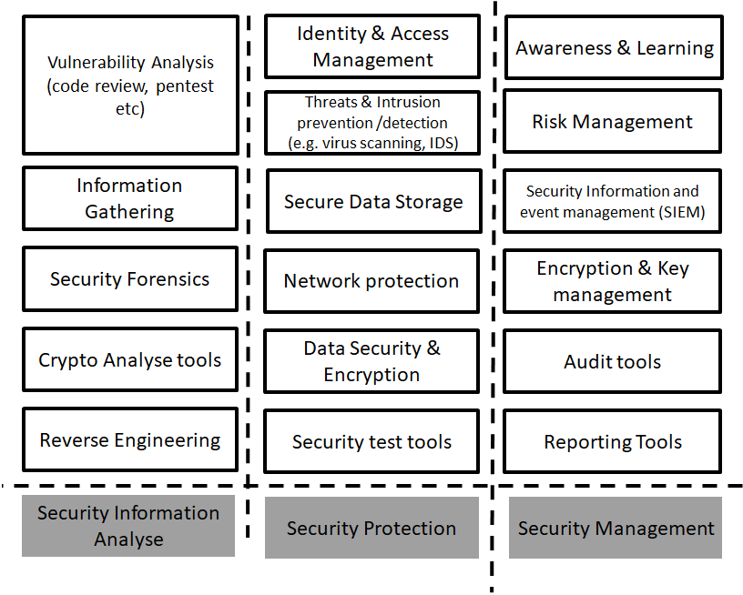

## Standard security ABBs in reference architectures

A good, reusable security reference architecture will contain a standard topology of Architecture Building Blocks (ABBs). However, be aware that in most reference architectures created by software vendors (Microsoft, Oracle, IBM, AWS, etc.), ABBs are often intertwined with their commercially offered solutions — which are, in fact, Solution Building Blocks (SBBs).

A reference architecture speeds up solution design. Many good reference architectures exist. In practice problems typically arise during the **translation from architecture into implemented solutions**. All too often, a clean mapping from architectural concepts to tangible, working solutions is not possible.

## The overwhelming number of security products

The range of security applications available to solve your problems is overwhelming. Nevertheless, for a good security architecture you must **first determine *what* must be solved** before jumping into solutions. Only when you have a solid understanding of your problem can you make an effective selection of security solutions that genuinely reduce risk.

## A conceptual security topology

The following conceptual security topology helps you arrange the mapping from functional needs to product implementations:

## Choosing SBBs: open source vs. commercial solutions

For every security function or service you need, you should seriously consider using **open, transparent, reusable solutions (SBBs)** — that is, open source software (FOSS).

Of course, many vendors provide good, solid security products for specific use cases. However, note that for any *trivial* security service, a working and maintained FOSS application is almost always available. Moreover, when using a FOSS security solution, you have a wide choice of companies that deliver maintenance and support on a commercial basis.

If you really practice Security By Design you should embrace the [principle Open design (Avoid security by obscurity)](../principles/securityprinciples.md). This will guide you often towards FOSS security solutions.

