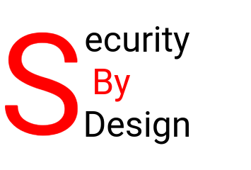

## Why create a security architecture?

To prevent security disasters, you must develop a security architecture from the very start. However, creating one is not simple by default.

That said, creating a security architecture for a specific product does **not** have to be complex. Too often, security architectures drift from their essential goal: thinking in advance about measures to mitigate common security vulnerabilities. The result is long documents that are seldom read and useless for engineers.

:::tip
A security architecture supports the continuous process of optimising and controlling your security risks.
:::

---

## Steps for creating a security architecture using Security by Design practices

Creating a security or privacy solution architecture consists of at least the following steps:

### 1. Define scope, goals and risk assessment

- Dive into the business strategy and organisation. Perform a simple risk assessment.
- Establish the business context, assets, and high-level risk appetite.
- Gather security principles and requirements relevant to your context.
- Identify important constraints (e.g., time, budget, available subject matter experts).
- Use a good reference architecture (external or internal) to maintain clear focus.
- **Use a risk-based approach.** Without a discussion with responsible management on risks and possible mitigation costs, it is useless to proceed. Creating a threat model is vital.
- Work principle‑based.
- Determine constraints that apply to your architecture or design (e.g., time, budget, maintenance costs, expert availability).

### 2. Determine (and actively elicit) requirements

- Create a threat model (e.g., STRIDE, LINDDUN).
- Apply a security model (e.g., Zero Trust, least privilege).
- Use design principles (e.g., defence in depth, fail secure).

### 3. Define the required Architecture Building Blocks (ABBs)

- Specify what the system must do in technology-agnostic terms.
- **Document your design decisions and rationale** – this is critical for auditability and reuse.
- Derive ABBs from your architecture or design. ABBs help you scope your solution, clarify (new) integration aspects, and show where new solutions fit into the total IT landscape.

### 4. Identify the Solution Building Blocks (SBBs) that realise your ABBs

- Map each ABB to concrete technologies, patterns, or products appropriate for your context.
- Select (or create, or buy) the new SBBs. Prerequisites (functionality and technical constraints) must be clear and are often derived from the previous design step.
- Speed up selection and evaluation of FOSS security solutions using [this free guide](https://nocomplexity.com/documents/securitysolutions/intro.html).

### 5. Review and assess

- Review and improve your solution. Use internal and external stakeholders, but also seek input from one or more **external independent reviewers**. An external reviewer has **no** internal interests and is solely focused on improving your security architecture.
- If you need help finding an external reviewer, [just ask for advice](https://nocomplexity.com/securityreview/).

:::note
Creating a good security architecture – including a threat model, requirements gathering, and constraint discussions – is an **iterative process**. Avoid creating a blueprint architecture in splendid isolation without discussion with all stakeholders. That has never worked.
:::

