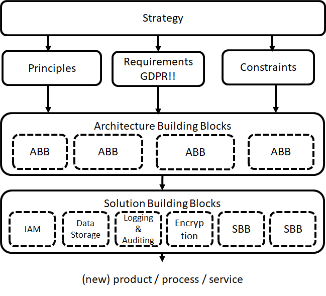

# Security Architecture

To create a sustainable solution to reduce cyber security threats is to create a solution architecture. Within this architecture you design a solution that meets your functional requirements. But this architecture is also to match design the protection measurements needed based on your risk analysis.

The perfect solution to reduce security risks to zero does not exist. A security architecture assists in the process of optimising and managing your risks.

A good way to really speed up creating your solution architecture is of course to use [this reference architecture](https://nocomplexity.com/documents/securityarchitecture/introduction.html) as the basis. 

A Security Architecture describes how security measurements are positioned. Measurements can be process related or be implemented by a security product such as a SIEM system.


:::{admonition} Definition of Security Architecture
:class: tip, dropdown
Security architecture has many definitions. In essence a good architecture is a set of security principles, methods and models designed to align to your objectives and help keep your organization safe from cyber threats. An architecture is not a technical design with VLANs and security zones. A Security architecture translates the business requirements to executable security requirements. 
:::





## Learn more

```{tip} Learn more about creating a Security Architecture
Do not reinvent the wheel by defining your own security principles. Make use of already good defined and battle tested security principles.
In the [Open Security Reference Architecture](https://nocomplexity.com/documents/securityarchitecture/introduction.html) you can find a complete guide to speed up the process to create your own security architecture.
```
