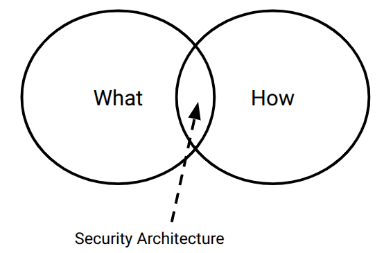
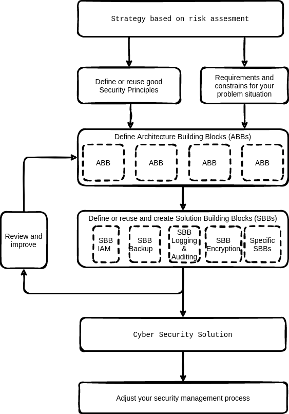

To create a sustainable solution to reduce cyber security threats is to create a solution architecture. Within this architecture you design a solution that meets your functional requirements. But this architecture is also to match design the protection measurements needed based on your risk analysis.

The perfect solution to reduce security risks to zero does not exist. A security architecture assists in the process of optimising and managing your risks.

A good way to really speed up creating your solution architecture is of course to use [this reference architecture](https://nocomplexity.com/documents/securityarchitecture/introduction.html) as the basis. 

A Security Architecture describes how security measurements are positioned. Measurements can be process related or be implemented by a security product such as a SIEM system.

## Security Architecture: The Bridge Between "What" and "How"

Security Architecture lives in the tension between what we need to achieve and how we will actually achieve it. Security Architecture is the complex field between what and how.



Most architects and consultants focus almost exclusively on the what—the policies, controls, and compliance requirements. But architects who truly practice Security By Design never lose sight of the how.

Why? Because the how is what makes or breaks a secure architecture.

If a security control cannot be implemented simply, it will:

- Be misconfigured

- Be bypassed

- Be abandoned

And that means security is not helped—it is harmed.

The aims of a good and simple security architecture are:
1. ensure business continuity
2. comply with legal requirements and
3. to provide the organization with a competitive edge

## Security Architecture Definition and key aspects


:::{tip} Definition of Security Architecture
Security architecture has many definitions. In essence a good architecture is a set of security principles, methods and models designed to align to your objectives and help keep your organization safe from cyber threats. An architecture is not a technical design with VLANs and security zones. A Security architecture translates the business requirements to executable security requirements. 
:::





A security architecture serves the goal to move from abstract **security requirements** to concrete **technical implementations**, while staying within governance guardrails.


### 1. The “Why & Constraints”
- **Strategy, Requirements, Principles, Constraints, GDPR**  
  These set the *non-negotiable rules*.  
  - *Strategy* – Business-aligned security goals.  
  - *Requirements* – Functional & non-functional security needs.  
  - *Principles* – E.g., least privilege, defense in depth.  
  - *Constraints* – Budget, legacy systems, timeline.  
  - **GDPR** is highlighted because privacy & data protection are mandatory (not optional) in many architectures.

### 2. Architecture Building Blocks (ABBs)
> *High-level, technology-agnostic capabilities*

Common ABBs are:
- **Data** – Classification, handling, lifecycle.  
- **Logging** – Event collection, monitoring.  
- **Encryption** – At rest, in transit, in use.  
- **IAM** – Identity, authentication, authorization.  
- **Storage** – Secure data persistence.  
- **Auditing** – Compliance and forensics readiness.

ABBs answer *“what must the system do?”* without specifying how.

### 3. Solution Building Blocks (SBBs)
> *Concrete, implementable technologies or patterns*

Each **ABB** maps to one or more **SBBs**:  Some example SBBs are:
- ABB *Encryption* → SBB *TLS, AES-256, KMS*.  
- ABB *IAM* → SBB *OIDC, OAuth2, LDAP, RBAC engine*.  
- ABB *Auditing* → SBB *OpenTelemetry + SIEM forwarder*.


### 4. Outcome
> **(new) product / process / service**

The entire flow delivers a **secure-by-design** asset, not just a checklist.


## Key learning points

- **Never start with Solution Building Blocks (SBBs)** – Avoid jumping straight to tools such as “we’ll use AWS KMS” without first establishing the underlying security rationale.
- **Always start with Architecture Building Blocks (ABBs)** – Derive these from your security principles, requirements, and mandatory constraints such as GDPR.
- **Treat GDPR as an explicit constraint** – It governs *where* data may be stored, *how* logs handle personally identifiable information (PII), and *which* ABBs and SBBs are permissible.


## Steps for creating a security architecture using Security by Design practices

1. **Define scope, goals and risk assessment**  
   Establish the business context, assets, and high-level risk appetite.

2. **Determine (and actively elicit) requirements**  
   - Create a threat model (e.g., STRIDE, LINDDUN).  
   - Apply a security model (e.g., Zero Trust, least privilege).  
   - Use design principles (e.g., defence in depth, fail secure).

3. **Define the required Architecture Building Blocks (ABBs)**  
   Specify what the system must do in technology-agnostic terms.  
   **Document your design decisions and rationale** – this is critical for auditability and reuse.

4. **Identify the Solution Building Blocks (SBBs) that realise your ABBs**  
   Map each ABB to concrete technologies, patterns, or products appropriate for your context.


:::{warning}
**You are never finished.** Security is a **continuous process**, not a one‑time deliverable.
:::


## Learn more

```{tip} Learn more about creating a Security Architecture
Do not reinvent the wheel by defining your own security principles. Make use of already good defined and battle tested security principles.
In the [Open Security Reference Architecture](https://nocomplexity.com/documents/securityarchitecture/introduction.html) you can find a complete guide to speed up the process to create your own security architecture.
```
