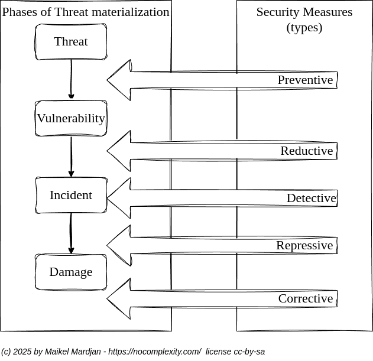

# Mitigate Cyber Risks

## Problem

Mitigating cyber security risks within a business is inherently complex, as it involves multiple organisational aspects and a wide range of stakeholders.

Understanding cyber security risks requires more than technical knowledge alone. It demands a combination of deep insight into IT systems, services, and contracts, alongside a clear understanding of business processes and priorities.

For non-technical stakeholders, grasping detailed technological concepts can be challenging without years of education and experience. Conversely, understanding business processes, value chains, and operational impact is a distinct discipline that technical specialists may not fully possess. Bridging this gap between technical and business perspectives is one of the key challenges in effective risk management.

## Solution

Business risk in cyber security can be defined as the likelihood that a threat, exploiting a vulnerability, results in a security incident that causes damage to an organisation’s information or IT services. The severity of this damage depends on the business value of the affected assets and the overall impact of the incident.

Before conducting a risk assessment, it is essential to establish a shared understanding of key principles:

1. The absence of threats would imply the absence of risk; however, threats are always present—even if they are not immediately visible or well understood.
2. The absence of vulnerabilities could imply minimal risk; in practice, vulnerabilities always exist within hardware, firmware, software, and network technologies.
3. Without appropriate detection measures, it is difficult to determine whether information has been accessed, copied, or altered. Due to the nature of digital systems, detecting unauthorised changes or duplication of data—whether at rest, in transit, or in use—remains a significant challenge.

To simplify a risk assessment:

* Focus on reducing and managing vulnerabilities
* Focus on reducing exposure to threats

The most significant business risks typically arise from systems and services that have high business value and are exposed to substantial threats. A practical way to support decision-making is to compare different types of security measures against their associated costs and benefits, enabling informed discussions on which controls are necessary and which may be excessive.

