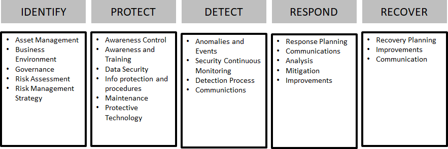

## Adopt a framework to manage information security

Your organisation should establish a framework to direct and coordinate the management of information security. The best approach is to **adopt and adapt** an existing, battle‑tested framework rather than building one from scratch.

A suitable framework must:

- Be appropriate to the level of security risk in your information environment
- Be consistent with your business needs and legal obligations
- Integrate with any other frameworks governing your organisation’s security

In a typical organisation, the security framework is **driven by the business strategy**.

Risk assessments are vital for determining:
1. **Security strategy** – whether and why security controls are needed at all
2. **Security controls** – which specific controls to implement

> **Order matters.** First establish *if* security controls are required, based on risk. Only then define *which* controls.

One of the simplest and most frequently used security frameworks is the **NIST model** (e.g., NIST Cybersecurity Framework or NIST SP 800-53).

