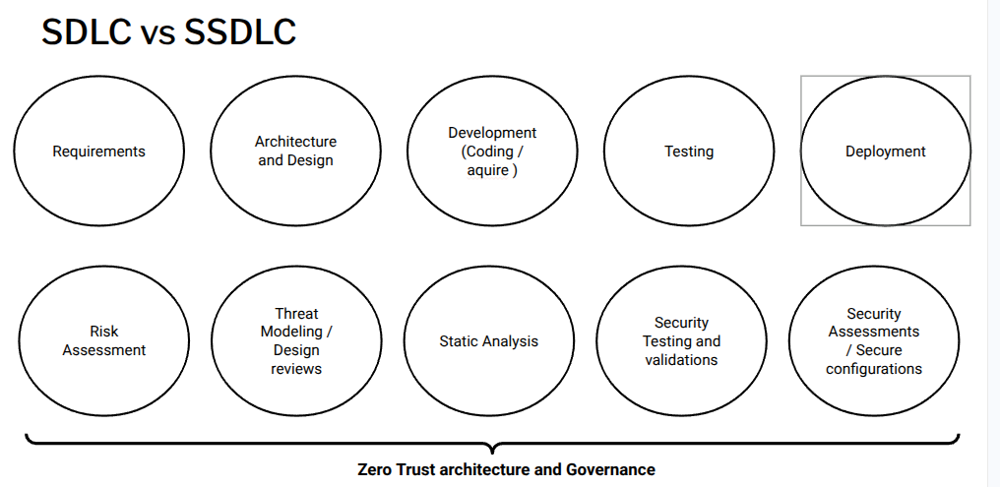

The diagram compares a traditional Software Development Life Cycle (SDLC) with a Secure Software Development Life Cycle (SSDLC). Its main message is simple: **security must be built into every stage**, not added at the end.

The top row shows the usual development steps: **Requirements**, **Architecture and Design**, **Development**, **Testing**, and **Deployment**. These represent how software is typically planned, built, and released.

The bottom row shows the **security activities** that should happen alongside each step:

* In **Requirements**, carry out a **risk assessment** to identify threats early.
* In **Design**, use **threat modelling and design reviews** to prevent weaknesses in the architecture.
* In **Development**, apply **static analysis** to find vulnerabilities in the code.
* In **Testing**, perform **security testing** to ensure the system behaves safely under attack.
* In **Deployment**, complete **security checks and apply secure configurations** before release.

:::{important} 
The key point is that security is **continuous**, not a separate phase.
:::

Across all stages, **Zero Trust principles** and all **[Security By Design principles](principles/securityprinciples.md)** MUST apply, so:
* **Assume systems may already be compromised**, verify every access request, and give only the minimum access required.

